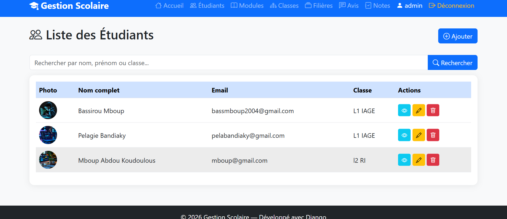
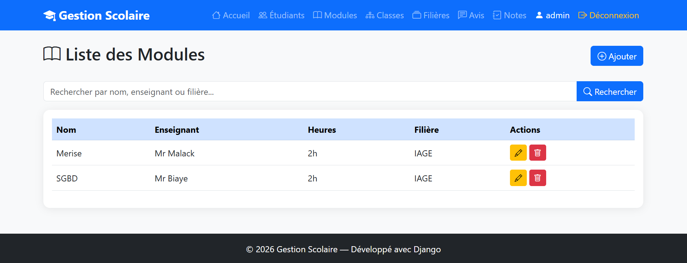
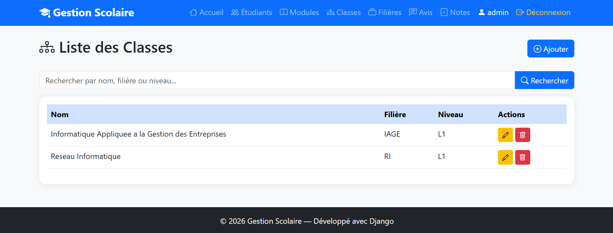
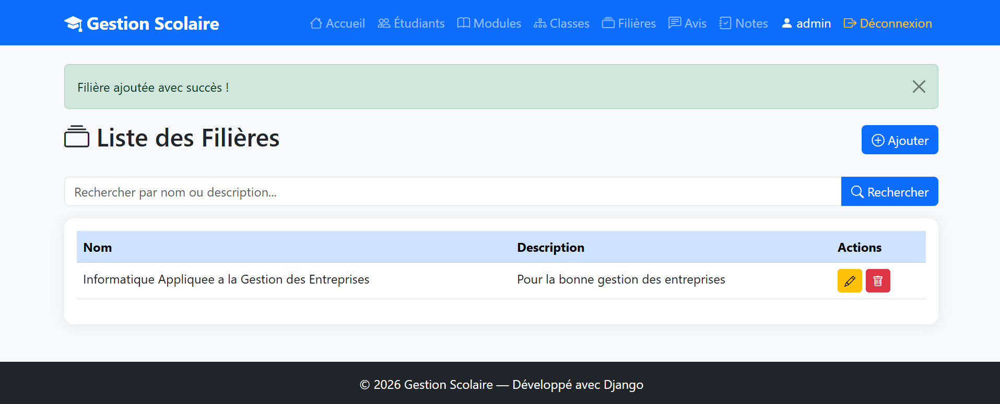
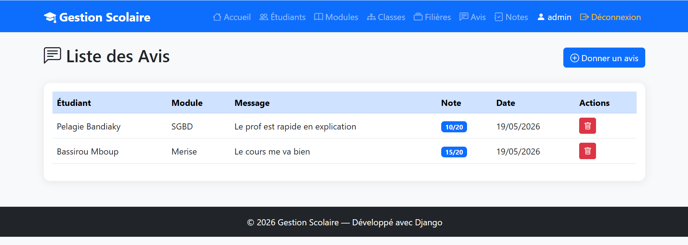
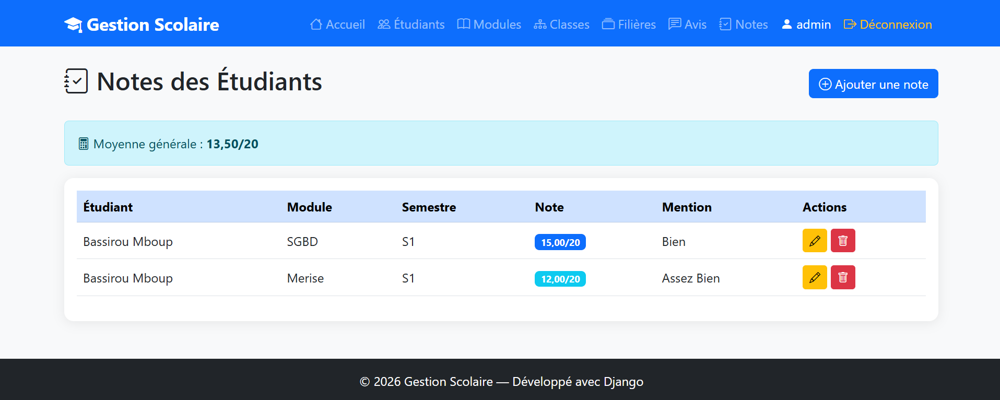

# 🎓 Gestion Scolaire

> Application web complète de gestion scolaire développée avec Django 6 et Python 3.14.


---

## 📌 Présentation

**Gestion Scolaire** est une application web développée dans le cadre d'un projet académique en **2ème année d'Informatique Appliquée à la Gestion des Entreprises (IAGE)**. Elle permet de gérer les étudiants, les modules, les classes, les filières, les notes et les avis de façon centralisée et sécurisée, avec un système de rôles complet.

---

## 📸 Captures d'écran

| Page | Description |
|---|---|
|  | Page de connexion sécurisée |
|  | Page d'inscription avec choix de rôle |
|  | Tableau de bord avec statistiques |
|  | Liste des étudiants avec recherche |
|  | Liste des modules avec recherche |
|  | Liste des classes avec recherche |
|  | Liste des filières avec recherche |
|  | Liste des avis avec notes |
|  | Gestion des notes avec mentions |

---

## ✨ Fonctionnalités

### 👤 Gestion des utilisateurs
- Inscription avec choix de rôle (Étudiant / Professeur)
- Connexion et déconnexion sécurisées
- Gestion des rôles et permissions par groupes Django

### 🎓 Gestion scolaire
- **Étudiants** — CRUD complet avec photo de profil et page détail
- **Modules** — Gestion des cours et enseignants
- **Classes** — Organisation par niveau et filière
- **Filières** — Gestion des départements
- **Notes** — Saisie et consultation des notes avec calcul de moyenne et mentions
- **Avis** — Notation des modules par les étudiants

### 📊 Notes et moyennes
- Saisie des notes par semestre (S1 / S2)
- Calcul automatique de la moyenne générale
- Système de mentions :
  - 🟢 **Très Bien** — 16 à 20
  - 🔵 **Bien** — 14 à 16
  - 🔵 **Assez Bien** — 12 à 14
  - 🟡 **Passable** — 10 à 12
  - 🔴 **Insuffisant** — moins de 10

### 🔐 Sécurité et rôles
| Fonctionnalité | Étudiant | Professeur | Admin |
|---|---|---|---|
| Consulter les données | ✅ | ✅ | ✅ |
| Consulter ses propres notes | ✅ | ✅ | ✅ |
| Ajouter / Modifier | ❌ | ✅ | ✅ |
| Saisir les notes | ❌ | ✅ | ✅ |
| Supprimer | ❌ | ✅ | ✅ |
| Donner un avis | ✅ | ✅ | ✅ |
| Accès Admin Django | ❌ | ❌ | ✅ |

### 🔍 Autres fonctionnalités
- Recherche dynamique sur toutes les listes
- Page détail pour chaque étudiant
- Tableau de bord avec statistiques en temps réel
- Upload de photos de profil
- API REST complète avec Django REST Framework
- Interface responsive Bootstrap 5

---

## 🛠️ Stack technique

| Technologie | Version | Rôle |
|---|---|---|
| Python | 3.14 | Langage principal |
| Django | 6.0.5 | Framework web |
| Django REST Framework | 3.x | API REST |
| Bootstrap | 5.3 | Interface utilisateur |
| Bootstrap Icons | 1.11 | Icônes |
| SQLite | — | Base de données |
| Pillow | 12.x | Gestion des images |
| Gunicorn | — | Serveur de production |
| Whitenoise | — | Fichiers statiques |

---

## 📁 Structure du projet

```
gestion_scolaire/
├── accounts/                  # Authentification & gestion utilisateurs
│   ├── views.py               # Login, logout, register
│   └── urls.py                # Routes accounts
├── config/                    # Configuration Django
│   ├── settings.py            # Paramètres du projet
│   ├── urls.py                # Routes principales
│   └── wsgi.py                # Déploiement
├── scolaire/                  # Application principale
│   ├── models.py              # Modèles de données
│   ├── views.py               # Vues CRUD
│   ├── forms.py               # Formulaires
│   ├── urls.py                # Routes scolaire
│   ├── admin.py               # Interface admin
│   ├── serializers.py         # Serializers API REST
│   └── api_views.py           # Vues API REST
├── templates/                 # Templates HTML
│   ├── base/
│   │   └── base.html          # Template de base
│   ├── accounts/
│   │   ├── login.html         # Page connexion
│   │   └── register.html      # Page inscription
│   └── scolaire/
│       ├── index.html         # Tableau de bord
│       ├── etudiant_liste.html
│       ├── etudiant_detail.html
│       ├── etudiant_form.html
│       ├── module_liste.html
│       ├── classe_liste.html
│       ├── filiere_liste.html
│       ├── avis_liste.html
│       ├── note_liste.html
│       ├── note_form.html
│       └── note_confirm_supprimer.html
├── static/                    # Fichiers CSS/JS
│   └── css/
│       └── style.css
├── screenshots/               # Captures d'écran de l'application
│   ├── login.png
│   ├── register.png
│   ├── dashboard.png
│   ├── etudiants.png
│   ├── modules.png
│   ├── classes.png
│   ├── filieres.png
│   ├── avis.png
│   └── notes.png
├── media/                     # Photos uploadées
├── requirements.txt           # Dépendances Python
├── Procfile                   # Configuration Railway
└── README.md
```

---

## 🚀 Installation locale

### Prérequis
- Python 3.10+
- pip
- Git

### Étapes

**1. Cloner le projet**
```bash
git clone https://github.com/BassirouAKMB/gestion_scolaire.git
cd gestion_scolaire
```

**2. Créer l'environnement virtuel**
```bash
python -m venv env

# Windows
env\Scripts\activate

# Mac / Linux
source env/bin/activate
```

**3. Installer les dépendances**
```bash
pip install -r requirements.txt
```

**4. Appliquer les migrations**
```bash
python manage.py migrate
```

**5. Créer les groupes de rôles**
```bash
python manage.py shell
```
```python
from django.contrib.auth.models import Group
Group.objects.create(name='Professeur')
Group.objects.create(name='Etudiant')
exit()
```

**6. Créer un superutilisateur**
```bash
python manage.py createsuperuser
```

**7. Lancer le serveur**
```bash
python manage.py runserver
```

Accède à l'application sur **http://127.0.0.1:8000** 🚀

---

## 🔗 URLs principales

| URL | Description |
|---|---|
| `/` | Tableau de bord |
| `/etudiants/` | Liste des étudiants |
| `/modules/` | Liste des modules |
| `/classes/` | Liste des classes |
| `/filieres/` | Liste des filières |
| `/avis/` | Liste des avis |
| `/notes/` | Liste des notes |
| `/accounts/login/` | Connexion |
| `/accounts/register/` | Inscription |
| `/accounts/logout/` | Déconnexion |
| `/admin/` | Interface admin Django |
| `/api/` | API REST |

---

## 🌐 API REST

Base URL : `/api/`

| Endpoint | Méthodes | Description |
|---|---|---|
| `/api/etudiants/` | GET, POST | Liste et création |
| `/api/etudiants/{id}/` | GET, PUT, DELETE | Détail, modification, suppression |
| `/api/modules/` | GET, POST | Liste et création |
| `/api/modules/{id}/` | GET, PUT, DELETE | Détail, modification, suppression |
| `/api/classes/` | GET, POST | Liste et création |
| `/api/filieres/` | GET, POST | Liste et création |
| `/api/avis/` | GET, POST | Liste et création |

> ⚠️ Authentification requise pour tous les endpoints API.

---

## 🔒 Sécurité

- Protection CSRF activée sur tous les formulaires
- Cookies HTTP Only
- Protection contre le Clickjacking (X-Frame-Options)
- Variables sensibles via variables d'environnement (`os.environ`)
- Authentification requise sur toutes les pages (`@login_required`)
- Gestion des rôles par groupes Django
- Restriction d'accès aux notes selon le rôle

---

## 🚀 Déploiement sur Railway

**1.** Connecte-toi sur [railway.app](https://railway.app)

**2.** Clique **New Project** → **Deploy from GitHub**

**3.** Sélectionne le repo `gestion_scolaire`

**4.** Ajoute les variables d'environnement :

| Variable | Valeur |
|---|---|
| `SECRET_KEY` | Ta clé secrète Django |
| `DEBUG` | `False` |

**5.** Railway déploie automatiquement ✅

---

## 👤 Auteur

**Bassirou AKMB**
- 🎓 Étudiant en L2 IAGE
- 💻 GitHub : [@BassirouAKMB](https://github.com/BassirouAKMB)
- 📧 bassmboup2004@gmail.com

---

## 📝 Licence

Ce projet est open source et disponible sous licence **MIT**.

---

> *Projet développé dans le cadre de la formation en Informatique Appliquée à la Gestion des Entreprises (IAGE) — 2026*
